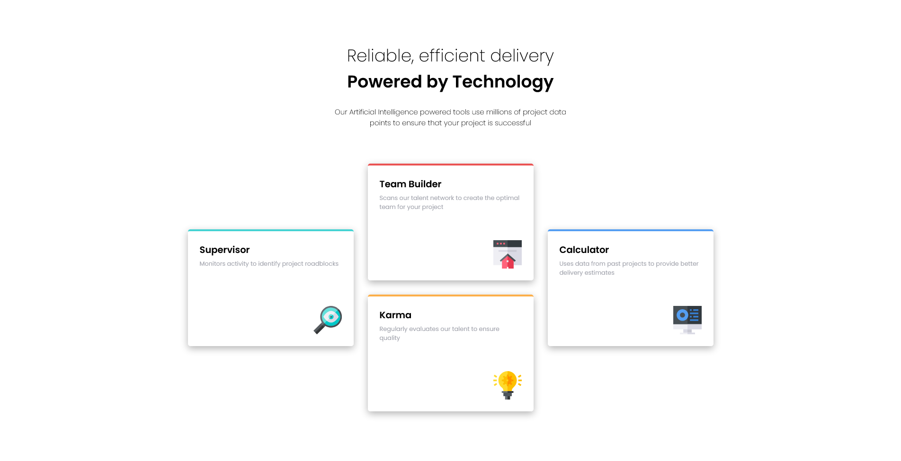

# Frontend Mentor - Four card feature section solution

This is a solution to the [Four card feature section challenge on Frontend Mentor](https://www.frontendmentor.io/challenges/four-card-feature-section-weK1eFYK). Frontend Mentor challenges help you improve your coding skills by building realistic projects.

## Table of contents

- [Overview](#overview)
  - [The challenge](#the-challenge)
  - [Screenshot](#screenshot)
  - [Links](#links)
- [My process](#my-process)
  - [Built with](#built-with)
  - [What I learned](#what-i-learned)
- [Author](#author)

## Overview

### The challenge

Users should be able to:

- View the optimal layout for the site depending on their device's screen size

### Screenshot



### Links

- Solution URL: [Solution URL](https://github.com/WidePeepoHappy/four-cards)
- Live Site URL: [Live site URL](https://widepeepohappy.github.io/four-cards)

## My process

### Built with

- Semantic HTML5 markup
- Flexbox
- Mobile-first workflow
- Sass
- BEM

### What I learned

Learned a bit more about how to style a flex box:

```css
.cards {
    display: flex;
    flex-direction: column;

    @media (min-width: 768px) {
      flex-direction: row;
      flex-wrap: wrap;

      &__container {
        display: flex;
        flex-wrap: wrap;
        order: 2;
      }
    }

    @media (min-width: 1200px) {
      flex-wrap: unset;

      &__container {
        flex-wrap: unset;
        order: unset;
        flex-direction: column;
      }
    }
```

## Author

- Frontend Mentor - [@yourusername](https://www.frontendmentor.io/profile/WidePeepoHappy)
